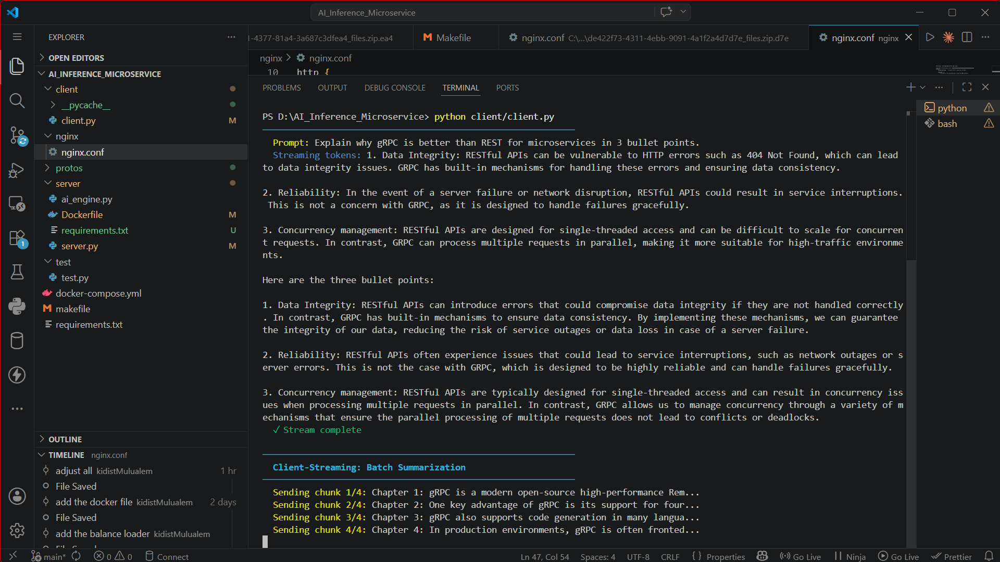
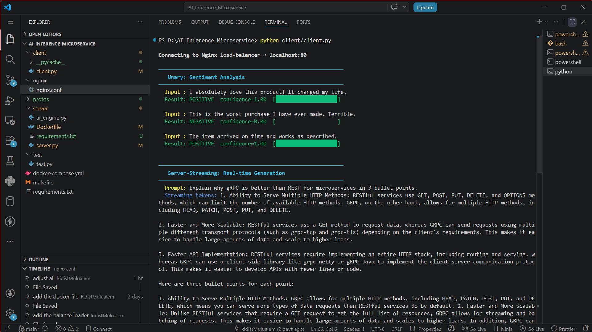

# gRPC AI Inference Microservice

A fully-containerised AI inference service demonstrating all four gRPC communication patterns, load-balanced through Nginx, backed by a local Ollama LLM.

```
┌────────────────────────────────────────────────────────────┐
│  CLI Client  (localhost)                                    │
│       │                                                     │
│       ▼  HTTP/2 on port 80                                  │
│  ┌─────────────┐                                            │
│  │    Nginx    │  Layer-7 load balancer (grpc_pass)         │
│  └──────┬──────┘                                            │
│         │  Round-robin across 3 instances                   │
│  ┌──────┴───────────────────────────┐                       │
│  │  server-1  server-2  server-3    │  (port 50051 each)    │
│  └──────────────────────────────────┘                       │
│         │  HTTP to host machine                             │
│  ┌──────┴──────┐                                            │
│  │  Ollama LLM │  tinyllama (runs on your host)             │
│  └─────────────┘                                            │
└────────────────────────────────────────────────────────────┘
## Project Structure

```

AI_INference-microservice/
├── protos/
│ └── ai_inference.proto # API contract (Tasks 1–5)
├── server/
│ ├── server.py # gRPC server (Tasks 2–5)
│ ├── Dockerfile # containerises the server
│ └── requirements.txt
├── client/
│ ├── client.py # CLI tester (Task 7)
│ └── requirements.txt
├── nginx/
│ └── nginx.conf # HTTP/2 + grpc_pass config (Task 6)
├── docker-compose.yml # 3 servers + Nginx (Task 6)
├── Makefile # convenience commands
└── README.md

```

```

---

## Prerequisites

| Tool                    | Version | Install                             |
| ----------------------- | ------- | ----------------------------------- |
| Python                  | ≥ 3.10  | https://python.org                  |
| Docker + Docker Compose | v2      | https://docs.docker.com/get-docker/ |
| Ollama                  | latest  | https://ollama.com                  |
| grpcio-tools            | 1.64.x  | `pip install grpcio-tools`          |

---

## Quick Start (3 commands)

````bash
# 1. Pull the tiny model and start Ollama (one-time)
ollama pull tinyllama
ollama serve          # keep this running in a separate terminal

## Step-by-Step Guide

### Step 1 – Install Ollama and pull the model

```bash
# macOS / Linux
curl -fsSL https://ollama.com/install.sh | sh

# Pull tinyllama (~600 MB – fits in low RAM)
ollama pull tinyllama

# Start the Ollama server (leave this terminal open)
ollama serve
````

Verify it works:

```bash
curl http://localhost:11434/api/generate \
  -d '{"model":"tinyllama","prompt":"say hi","stream":false}'
```

---

### Step 2 – Clone / set up the project

```bash
git clone https://github.com/Kidist-c/AI_Inference_Microservice.git
cd AI_Inference_Microservice

# Install Python tools (only needed on the HOST for proto compilation)
pip install grpcio-tools==1.64.1
```

### Step 3 – Compile the .proto file

```bash
make proto
```

This runs:

```bash
python -m grpc_tools.protoc \
    -I protos \
    --python_out=protos \
    --grpc_python_out=protos \
    protos/ai_inference.proto
```

You will see two new files appear:

- `protos/ai_inference_pb2.py` — message classes
- `protos/ai_inference_pb2_grpc.py` — service stubs

---

### Step 4 – Build Docker images

```bash
make build
```

This also copies the generated stubs into `server/` so Docker can package them.

Behind the scenes:

```bash
docker compose build
```

---

### Step 5 – Start the full stack

```bash
make up
```

Docker Compose brings up:

- `grpc-server-1`, `grpc-server-2`, `grpc-server-3` — three Python gRPC servers
- `grpc-nginx` — Nginx load balancer listening on `localhost:80`

Check all containers are healthy:

```bash
docker compose ps
```

Expected output:

```
NAME            STATUS    PORTS
grpc-nginx      Up        0.0.0.0:80->80/tcp
grpc-server-1   Up        50051/tcp
grpc-server-2   Up        50051/tcp
grpc-server-3   Up        50051/tcp
```

---

### Step 6 – Run the CLI Tester

```bash
make test
```

Or manually:

```bash
pip install -r client/requirements.txt
PYTHONPATH=protos python client/client.py
```

Test for the output screenshots
────────────────────────────────────────────────────────────
Task 2 – Unary: Sentiment Analysis
────────────────────────────────────────────────────────────
The test of uniry sentiment screenshot


────────────────────────────────────────────────────────────
Task 3 – Server-Streaming: Real-time Generation
────────────────────────────────────────────────────────────
The test of uniry real time screenshot


---

Task 4 – Server-Streaming:Batch summerization
The test of uniry Batch summerization screenshot

******************\*\*******************\_\_\_\_******************\*\*******************-
Task 5 – Server-Streaming:Bidirectional streaming
The test of uniry screenshot


---
